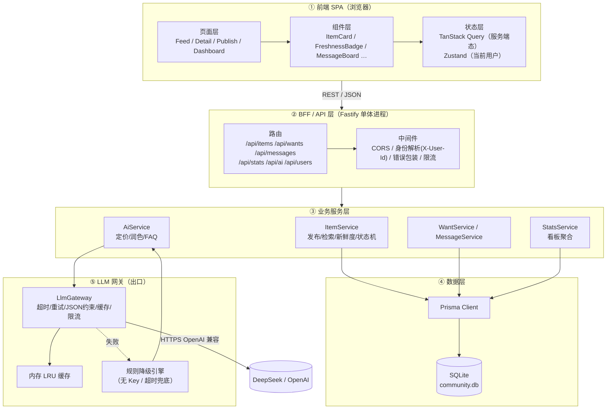
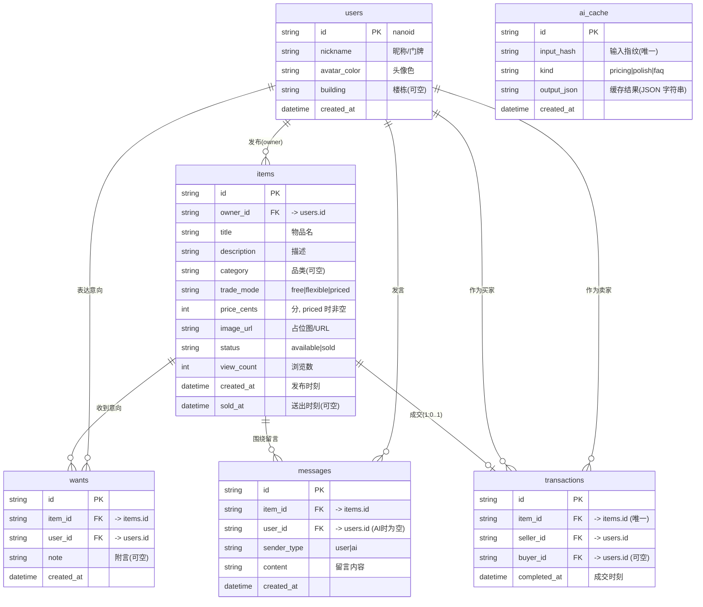
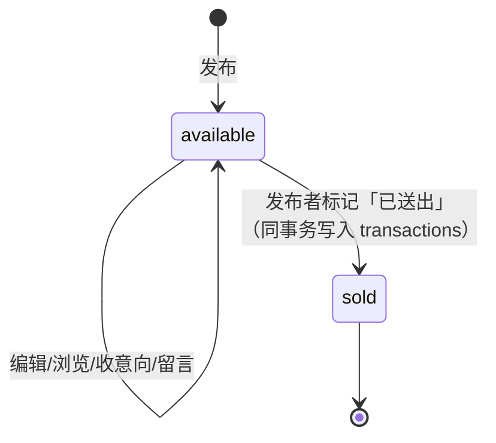
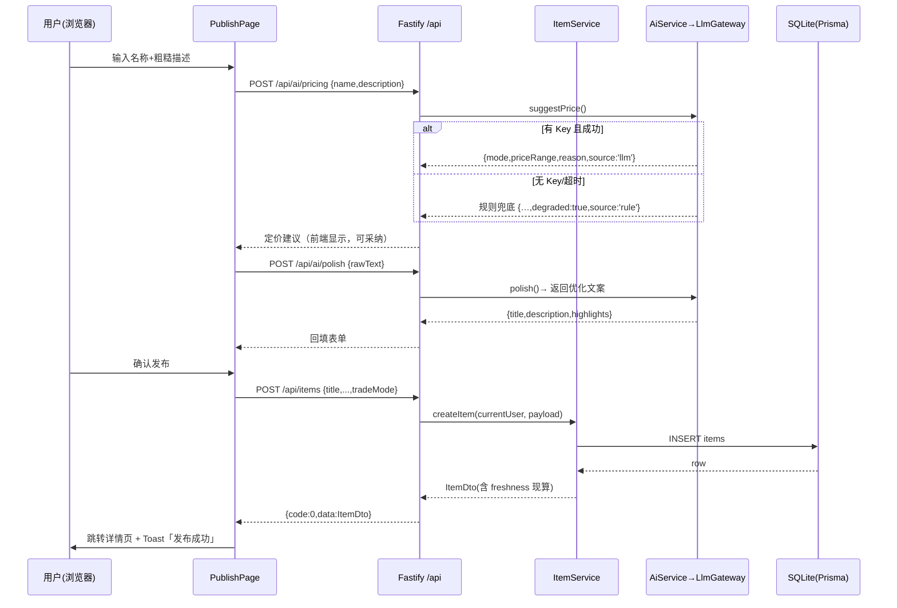
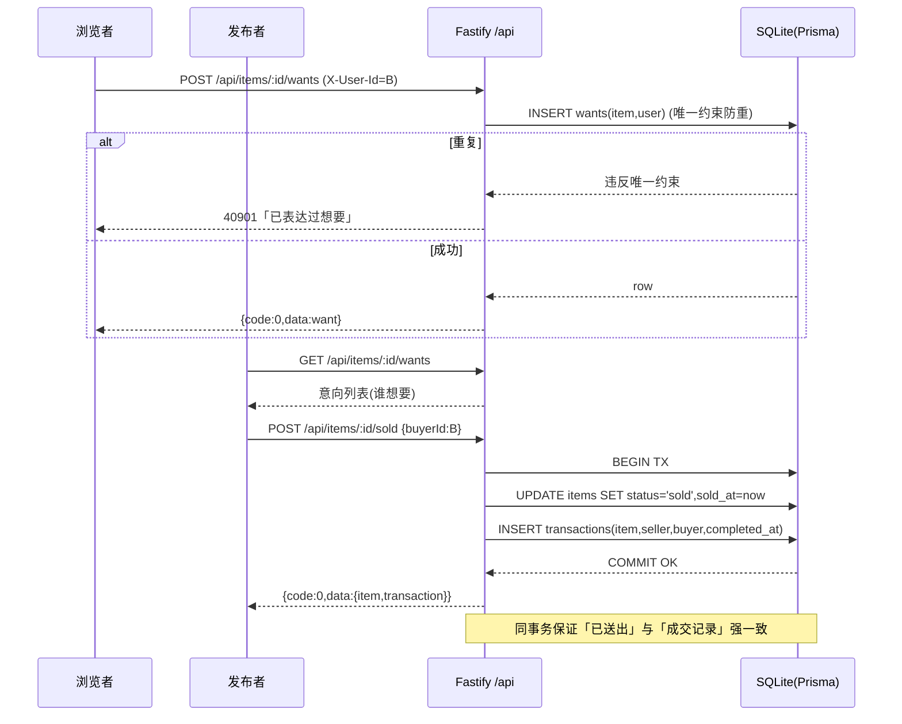
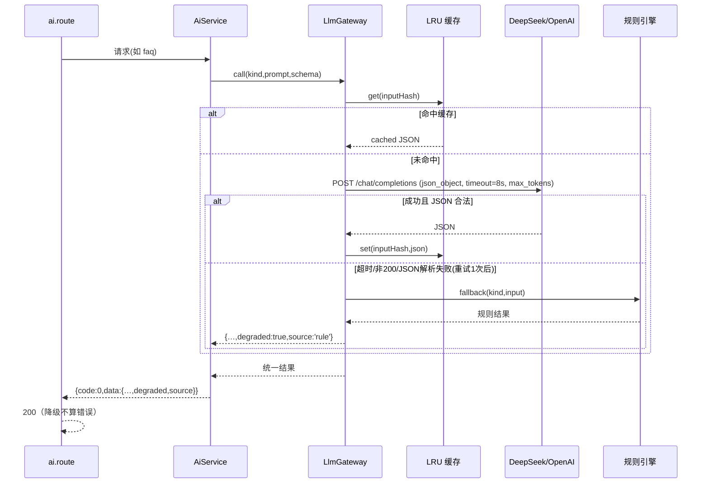
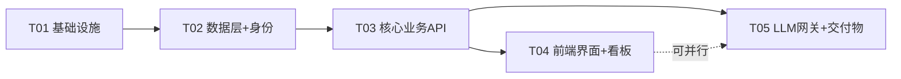

# 邻里流转 · 全栈技术方案（Tech Design）

> 项目：小区/楼栋/办公室内部闲置物品流转工具
> 场景：AI Coding 实战考试（24h 单人 + AI 辅助）
> 交付载体：可本地一键运行的全栈应用 + 5 分钟 Demo 视频 + 数据库 ER 图 + 技术栈简介
> 文档定位：**施工图**。工程师照此即可按顺序在 24h 内搭出全栈。

---

## 0. TL;DR（10 行内）

- **一句话定位**：一个"让闲置物品在沉没前被看到"的轻量社区流转工具，主打 **卡片流 + 新鲜度 + LLM 助写文案/定价**，单进程全栈，本地一键跑。
- **前端**：Vite + React 18 + TypeScript + Tailwind CSS + shadcn/ui（Radix 原语）+ TanStack Query + Zustand。
- **后端**：Node 单体（Fastify）BFF，REST 契约；开发期 Vite 代理，生产期同进程托管静态资源 → **只跑一个进程**。
- **数据库**：SQLite + Prisma（文件型 DB，零运维；`prisma db push` + `prisma studio` 是 24h 的时间杀手）。
- **身份**：**无密码**极简方案——`users` 表 + 顶部"我是谁"切换器 + `X-User-Id` 请求头。熟人社不需要信用体系。
- **LLM**：统一网关（DeepSeek/OpenAI 兼容），**JSON 约束输出 + 超时 + 重试 + 规则引擎兜底**；无 Key/断网自动降级，Demo 不黑屏。
- **取舍原则**：**能跑 > 好看 > 完整**。凡是"24h 内跑不起来"或"增加运维面"的，一律降级或砍掉，用占位与前缀替代。
- **P0**：发布 / 卡片流 / 筛选搜索 / 新鲜度 / 我想要 / 留言板 / 标记已送出 / 看板 / LLM 三能力（带降级）。
- **P1**：我的物品、图片 URL 化、AI 回复一键填入留言板、FTS5 全文检索、看板图表。
- **P2（砍）**：真实登录、文件上传、通知、多小区多租户、地图、分页无限滚动。

---

## 1. 技术选型与取舍

### 1.1 选型总表

| 层 | 候选 | **选择** | 理由 | 放弃理由 |
|---|---|---|---|---|
| 前端框架 | CRA / Next.js / Vite+React | **Vite + React + TS** | 冷启动秒级、无 SSR 心智负担、AI Coding 工具对 Vite 模板最熟 | CRA 已废弃；Next.js 的 RSC/构建链在 24h 里是净负担 |
| UI | Ant Design / MUI / **Tailwind + shadcn/ui** | **Tailwind + shadcn/ui** | 复制即用、无"通用后台脸"、审美完全可控，直接对准"审美水准"评分项 | AntD/MUI "开箱即高级但千篇一律"，打磨空间小 |
| 服务端状态 | Redux / SWR / **TanStack Query** | **TanStack Query** | 缓存/失效/重试开箱即用，减少手写 loading/error 样板 | Redux 样板过重 |
| 客户端状态 | Context / **Zustand** | **Zustand**（仅存"我是谁"） | 10 行搞定，不引额外心智 | Context 重渲染、样板多 |
| 后端 | NestJS / **Fastify** / Express | **Fastify** | 轻、快、TS 友好、内置 pino 日志与校验链路 | Nest 装饰器/DI 在 24h 里是过度设计 |
| 数据库 | PostgreSQL+Docker / **SQLite+Prisma** / 纯 JSON | **SQLite + Prisma** | 零运维、有真实 schema/迁移/ER、类型安全、有 Studio 可视化 | PG+Docker 运维成本高；纯 JSON 无 schema/无查询、ER 图与"数据库设计合理"评分直接崩 |
| ORM | Prisma / Drizzle / 原生 SQL | **Prisma** | AI Coding 产出 schema 最稳、`db push`+`studio` 省时、社区 ERD 生成器现成 | Drizzle 更轻但需更多手写；留作 Prisma 引擎下载失败时的 Plan B |
| LLM | 直连 OpenAI SDK / **自建网关** | **自建网关（fetch + 降级）** | 可切换供应商、可降级、可缓存、可限流 | 直连 SDK 无兜底，断网即黑屏 |
| 运行时 | Docker Compose / **本机 Node** | **本机 Node + npm scripts** | 24h 考试里运维即风险；`npm run dev` 一条命令起全栈 | 多容器编排增加变量、拖慢迭代 |

### 1.2 三组关键决策的 trade-off

#### 决策 ①：数据库 —— SQLite+Prisma vs PostgreSQL+Docker vs 纯 JSON

| 维度 | SQLite + Prisma ✅ | PostgreSQL + Docker | 纯 JSON 文件 |
|---|---|---|---|
| 启动成本 | 0（一个 .db 文件） | 中（起容器、等 health、端口冲突） | 0 |
| Schema/迁移 | ✅ 有（migrations + db push） | ✅ 有 | ❌ 无 |
| ER 图交付 | ✅ 可由 schema 自动生成 | ✅ | ❌ 手画或没有 |
| "数据库设计合理"评分 | ✅ 高（真实约束/索引/关系） | ✅ 高 | ❌ 低（无关系、并发写风险） |
| 部署加分项（远端） | 中（文件需持久卷/换 PG） | ✅ 高 | 低 |
| 并发/多实例 | 弱（单写者） | ✅ 强 | ❌ 无 |
| 24h 风险 | **低** | 中（运维面） | 高（查询/聚合全靠手写） |

**结论**：选 **SQLite + Prisma**。理由：*本工具是"单小区、低并发、熟人"场景，SQLite 完全够用*；而考试要交 ER 图、要评"数据库设计合理"，Prisma schema 一举两得（既是施工源，又能生成交付物）。PG 的并发优势在本场景是**用不到的强项**，却带来**实打实的运维成本**。远端部署加分若要做，Prisma 换 `provider="postgresql"` + 改连接串即可，迁移成本可控。

#### 决策 ②：后端形态 —— 单体 Node(BFF) vs Next.js 全栈 vs 前后端完全分离

| 维度 | Node 单体(BFF) ✅ | Next.js 全栈 | 完全分离（SPA + 独立 API 服务） |
|---|---|---|---|
| 进程数 | **1** | 1 | 2（+ 代理配置） |
| 前后端解耦体现 | ✅ 清晰 REST 契约 | ⚠️ Server Actions 易与 UI 耦合 | ✅ 最清晰 |
| 一键运行 | ✅ `npm run dev` | ✅ | ⚠️ 需 concurrently + 代理 |
| AI Coding 友好 | ✅ | ⚠️ RSC/Server/Client 边界易踩坑 | ✅ |
| 学习/调试成本 | 低 | 中高 | 中 |
| 远端部署 | ✅ 单进程 | ✅ | 需分别部署或反代 |

**结论**：选 **单体 Node(BFF)**。关键认知修正：**"前后端解耦"指的是接口契约解耦，而不是"必须两个进程、两台机器"**。我们用一份完整的 REST 契约（见 §5）保证前端只依赖 HTTP 接口、后端不感知 UI；同时用单进程把 24h 的运维/联调成本压到最低。Next.js 的 RSC 心智负担与"Server/Client 组件"边界是 24h 里最典型的翻车点，不值得赌。

#### 决策 ③：前端形态 —— PC 优先响应式 vs 移动优先

| 维度 | PC 优先 + 响应式 ✅ | 移动优先 |
|---|---|---|
| Demo 录制 | ✅ 大屏卡片流信息密度高，一屏讲更多 | 一屏信息少，需更多滚动 |
| 看板展示 | ✅ 数据看板天然适合宽屏 | 图表在窄屏易拥挤 |
| 场景贴合 | ✅ "小区群"用户多为随手用电脑/也能手机 | 更贴合"手机随手拍" |
| 实现成本 | 低（Tailwind 断点） | 低 |
| 风险 | 需保证窄屏可用 | 需保证宽屏不空旷 |

**结论**：选 **PC 优先 + 响应式兜底**（`sm/md/lg` 三档，`lg` 三列卡片、`sm` 单列）。理由：这是**演示导向**的项目，评审看的是 5 分钟视频，宽屏信息密度 = 演示效率。移动端保证"能用"（单列 + 底部主按钮）即可，不做移动端专属交互。

### 1.3 为什么这套选型在 24h 里是最优解

1. **只有一个运行进程**：`npm run dev` 起 Vite + Fastify，生产 `npm run start` 单进程托管前端+API。运维变量≈0。
2. **零外部依赖即可启动**：无 DB 容器、无 Redis、无消息队列；唯一外部依赖（LLM）**有本地降级**。
3. **AI Coding 适配度最高**：Vite/React/Tailwind/Fastify/Prisma 都是主流栈，AI 工具补全命中率最高。
4. **交付物顺带产出**：Prisma schema → ER 图（考试要交），设计 token → 视频里的"审美"，网关 → "对大模型的熟悉"。
5. **取舍可辩护**：每一处"没做"都能说清是"场景不需要"还是"24h 不值得"，体现快速决策力。

---

## 2. 系统架构设计

### 2.1 分层架构图



### 2.2 目录结构（完整文件树 + 职责）

```
community-reuse/
├─ package.json                 # 依赖声明 + scripts（dev/build/start/db:*）
├─ tsconfig.json                # TS 编译配置（前后端共用 base）
├─ vite.config.ts               # Vite 配置 + /api 代理到 Fastify
├─ tailwind.config.ts           # Tailwind 主题 / 设计 token 扩展
├─ postcss.config.js            # Tailwind + autoprefixer
├─ .env.example                 # LLM_BASE_URL / LLM_API_KEY / LLM_MODEL / PORT / DB_URL
├─ index.html                   # SPA 入口 HTML
├─ README.md                    # 一键运行说明 + 技术栈简介（可作交付物底稿）
├─ prisma/
│  ├─ schema.prisma             # ★ 数据模型单一事实源（→ ER 图来源）
│  ├─ seed.ts                   # 种子数据（用户/物品/意向/留言，供 Demo）
│  └─ migrations/               # 迁移记录（db push / migrate 生成）
├─ scripts/
│  └─ export-erd.ts             # 由 schema 生成 ER 图 SVG/PNG（考试交付物）
├─ src/
│  ├─ server/                   # ② 后端（BFF）
│  │  ├─ index.ts               # 进程入口：装配路由/中间件/静态托管
│  │  ├─ app.ts                 # Fastify 实例 + 插件注册
│  │  ├─ db.ts                  # PrismaClient 单例
│  │  ├─ lib/
│  │  │  ├─ ok.ts               # 统一响应 {code,data,message} + 错误码
│  │  │  ├─ errors.ts           # AppError 与错误码常量
│  │  │  ├─ identity.ts         # 从 X-User-Id 解析当前用户
│  │  │  └─ freshness.ts        # ★ 新鲜度计算（刚上架/新上架/已上架X天）
│  │  ├─ services/              # ③ 业务服务
│  │  │  ├─ item.service.ts
│  │  │  ├─ want.service.ts
│  │  │  ├─ message.service.ts
│  │  │  ├─ stats.service.ts
│  │  │  └─ ai.service.ts       # 组装 prompt + 调网关 + 降级
│  │  ├─ ai/
│  │  │  ├─ gateway.ts          # ★ LlmGateway：超时/重试/cache/限流
│  │  │  ├─ prompts.ts          # 三条能力的完整 prompt 与 JSON schema
│  │  │  └─ fallback.ts         # 规则引擎兜底（定价/润色/FAQ 模板）
│  │  └─ routes/
│  │     ├─ items.route.ts
│  │     ├─ wants.route.ts
│  │     ├─ messages.route.ts
│  │     ├─ stats.route.ts
│  │     ├─ ai.route.ts
│  │     ├─ users.route.ts
│  │     └─ health.route.ts
│  ├─ shared/                   # 前后端共享类型与校验
│  │  ├─ types.ts               # ItemDto / WantDto / StatsDto …
│  │  └─ schemas.ts             # zod schema（同时用于后端校验）
│  └─ web/                      # ① 前端 SPA
│     ├─ main.tsx               # React 挂载 + QueryClientProvider
│     ├─ App.tsx                # 路由表 + 全局布局
│     ├─ styles.css             # Tailwind 指令 + CSS 变量（设计 token）
│     ├─ store/
│     │  └─ identity.ts         # Zustand：当前用户
│     ├─ api/
│     │  └─ client.ts           # fetch 封装（注入 X-User-Id、解包 {code,data}）
│     ├─ hooks/                 # useItems / useItem / useWants / useStats / useAi…
│     ├─ components/            # 通用组件
│     │  ├─ AppShell.tsx        # 顶部栏 + 用户切换器 + 导航
│     │  ├─ ItemCard.tsx
│     │  ├─ FreshnessBadge.tsx  # 新鲜度标识（配色 + 文案）
│     │  ├─ TradeModeTag.tsx
│     │  ├─ FilterBar.tsx       # 交易方式筛选 + 排序
│     │  ├─ SearchBox.tsx
│     │  ├─ EmptyState.tsx
│     │  ├─ SkeletonCard.tsx
│     │  ├─ MessageBoard.tsx
│     │  ├─ WantButton.tsx / WantList.tsx
│     │  └─ ai/                 # 定价/润色/FAQ 三个助手
│     │     ├─ PricingAssistant.tsx
│     │     ├─ PolishAssistant.tsx
│     │     └─ FaqAssistant.tsx
│     └─ pages/
│        ├─ FeedPage.tsx        # 首页卡片流
│        ├─ ItemDetailPage.tsx  # 详情：信息 + 意向 + 留言 + FAQ
│        ├─ PublishPage.tsx     # 发布：含 AI 定价 / 润色
│        ├─ DashboardPage.tsx   # 数据看板
│        └─ MePage.tsx          # 我的（P1）
```

> ★ 标注为**关键/易错文件**，工程实现时优先保证。

### 2.3 关键设计决策

**① 前后端如何解耦**
- 前端**只通过 `src/web/api/client.ts` 访问后端**，组件不直接 `fetch`。契约即 §5 的 REST 表。
- 所有跨层类型集中 `src/shared/types.ts`，后端 zod 校验与前端类型共用一份 `schemas.ts`，**改一处两端同步**。
- 后端路由层（route）只做：解析参数 → 调 service → 包装响应；业务逻辑全在 service，**route 不碰 Prisma**。

**② 鉴权怎么做（极简身份方案）**
- **不做登录/密码/Token**。理据：① 场景是"熟人小区"，原文明确"不需要复杂信用体系"；② 24h 里做真实登录是**性价比最低**的投入；③ Demo 需要快速切换"发布者/浏览者"两个角色。
- 方案：`users` 表存昵称；前端 Zustand 记住 `currentUserId`（localStorage 持久化）；每次请求带 `X-User-Id` 头；后端 `identity.ts` 解析为 `currentUser`。
- 顶部放**用户切换器**（下拉选昵称）。这既是身份方案，也是**绝佳的 Demo 道具**（同一个浏览器里 3 秒切换身份演示"我想要→发布者看到"）。

**③ 单进程 vs 双进程**
- 开发：`npm run dev` = `concurrently` 同时起 `tsx watch src/server/index.ts`（:3001）与 `vite`（:5173），Vite 代理 `/api` → :3001。
- 演示/发布：`npm run start` = 先 `vite build`，再由 Fastify `@fastify/static` 托管 `dist/`，**单进程 :3001 同时提供前端与 API**。断网也能跑。

---

## 3. 数据库设计

### 3.1 ER 图（考试交付物，可直接截图）



### 3.2 表清单（字段 / 类型 / 约束 / 索引 / 注释）

**users**

| 字段 | 类型 | 约束 | 说明 |
|---|---|---|---|
| id | TEXT | PK | nanoid(12) |
| nickname | TEXT | NOT NULL | 昵称，Demo 用「3栋-老王」 |
| avatar_color | TEXT | NOT NULL, default `#10b981` | 头像底色 |
| building | TEXT | NULL | 楼栋/单元（可选，场景化） |
| created_at | DATETIME | NOT NULL, default now | |

**items**

| 字段 | 类型 | 约束 | 说明 |
|---|---|---|---|
| id | TEXT | PK | |
| owner_id | TEXT | FK→users.id, NOT NULL, INDEX | 发布者 |
| title | TEXT | NOT NULL | 物品名 |
| description | TEXT | NOT NULL | 描述 |
| category | TEXT | NULL | 品类，供未来筛选 |
| trade_mode | TEXT | NOT NULL, INDEX | `free`/`flexible`/`priced` |
| price_cents | INTEGER | NULL | 仅 `priced` 有值（分为单位，避免浮点） |
| image_url | TEXT | NULL | 占位图 URL 或 emoji 占位 |
| status | TEXT | NOT NULL, default `available`, INDEX | `available`/`sold` |
| view_count | INTEGER | NOT NULL, default 0 | 详情页浏览计数 |
| created_at | DATETIME | NOT NULL, default now, INDEX | 新鲜度与排序基准 |
| sold_at | DATETIME | NULL | 标记送出时刻 |

> 复合索引：`@@index([status, created_at])`（卡片流主查询：在售 + 按新排序）、`@@index([trade_mode])`。

**wants**

| 字段 | 类型 | 约束 | 说明 |
|---|---|---|---|
| id | TEXT | PK | |
| item_id | TEXT | FK→items.id, NOT NULL, INDEX | |
| user_id | TEXT | FK→users.id, NOT NULL | |
| note | TEXT | NULL | 附言（可空） |
| created_at | DATETIME | NOT NULL | |

> 唯一约束：`@@unique([item_id, user_id])` → **同一人对同一物品只能"想要"一次**（业务级幂等，防刷）。

**messages**

| 字段 | 类型 | 约束 | 说明 |
|---|---|---|---|
| id | TEXT | PK | |
| item_id | TEXT | FK→items.id, NOT NULL, INDEX | |
| user_id | TEXT | FK→users.id, NULL | AI 生成时为空 |
| sender_type | TEXT | NOT NULL, default `user` | `user`/`ai` |
| content | TEXT | NOT NULL | 留言正文 |
| created_at | DATETIME | NOT NULL | |

**transactions**

| 字段 | 类型 | 约束 | 说明 |
|---|---|---|---|
| id | TEXT | PK | |
| item_id | TEXT | FK→items.id, **UNIQUE**, NOT NULL | 一物最多一笔成交 |
| seller_id | TEXT | FK→users.id, NOT NULL | |
| buyer_id | TEXT | FK→users.id, NULL | 未指定就从意向中选 |
| completed_at | DATETIME | NOT NULL | 「最快被领走」计算基准 |

**ai_cache**（P1，可省）

| 字段 | 类型 | 约束 | 说明 |
|---|---|---|---|
| id | TEXT | PK | |
| input_hash | TEXT | UNIQUE | `sha256(kind+规范化输入)` |
| kind | TEXT | NOT NULL | pricing/polish/faq |
| output_json | TEXT | NOT NULL | 缓存结果 |
| created_at | DATETIME | NOT NULL | |

### 3.3 关键设计点

**① 状态机（在售 / 已送出 / 归档）**


- 只有 **一个业务状态转换**：`available → sold`（不可逆，简化到极致）。
- **"归档" == `status = sold`**：不再是独立状态，避免多状态无谓复杂度。已归档物品**仍可 GET 查看**，但发布/想要/留言接口对 `sold` 物品返回 `40901`（不可操作）。
- 转换时**在同一数据库事务内**：`items.status=sold` + `items.sold_at=now` + `insert transactions`。保证"成交"数据不会半写。

**② 新鲜度：计算列 vs 存字段 → 结论：计算（不落库）**

| 方案 | 说明 | 问题 |
|---|---|---|
| 存字段（如 `freshness`） | 发布时写入 | ❌ 需定时任务/Cron 刷新，24h 里纯属自找麻烦；且与 `created_at` 冗余，存在不一致风险 |
| DB 计算列（generated） | 由 `created_at` 生成 | ⚠️ 依赖"当前时间"，generated column 不能引用 `now()`；不可行 |
| **读时计算（应用层）** ✅ | 查询后由 `created_at` 现算 | ✅ 零存储、零定时任务、永远正确 |

**结论**：新鲜度**不落库**，由后端 `src/server/lib/freshness.ts` 在**读时**基于 `created_at` 计算，作为响应字段 `freshness` 返回。前端 `FreshnessBadge` 只负责渲染。全部逻辑集中一处，可单测。

**③ 时间戳与「已上架 X 天」算法**

```
ageMs   = now - item.createdAt
ageHours= ageMs / 3600000
level   = ageHours < 24          ? "fresh"      // 刚上架
        : ageHours < 72          ? "new"        // 新上架
        :                          "aged"       // 已上架 X 天
label   = fresh → "刚上架"
          new   → "新上架"
          aged  → `已上架 ${Math.floor(ageHours/24)} 天`
```
- 统一返回结构：`freshness: { level, label, ageHours }`（前两者用于展示，`ageHours` 用于排序与调试）。
- **排序**：卡片流默认 `ORDER BY status='available' DESC?` → 实为 `ORDER BY created_at DESC`（越新越靠前），前端再叠加"我想要数"作为次要排序（P1）。
- 时区：DB 存 **UTC**，展示层用 `dayjs` 本地化，避免"跨零点变成 1 天"的争议。

### 3.4 数据库设计合理性论证（对准评分项）

1. **范式合规、无冗余**：新鲜度、成交耗时等衍生值一律**读时计算**，不落库，消除不一致源；`price_cents` 用整数分存储，规避浮点误差。
2. **关系建模正确**：`users/items/wants/messages/transactions` 五张表覆盖全部业务实体；外键明确，`transactions` 与 `items` 为 **1:0..1**（唯一约束保证"一物一成交"）。
3. **幂等与防重**：`wants` 上 `@@unique([item_id, user_id])` 让"重复点想要"在 DB 层被拦，业务代码无需额外查重。
4. **面向查询建索引**：卡片流主查询（`status=available` 按 `created_at` 排序）由复合索引 `(status, created_at)` 覆盖；`trade_mode`、`item_id` 单列索引覆盖筛选与关联查询。索引**按真实查询设计**，不做无脑全列索引。
5. **状态机最小化 + 事务一致性**：单一状态转换 + 同事务写 `transactions`，保证"已送出"与"成交记录"强一致，看板统计永不出现"已送出但无成交"。
6. **可演进**：未来加"多小区"只需新增 `communities` 表 + `items.community_id`；加"文件上传"只需 `items.image_url` 换 `attachments` 表——**当前 schema 不阻碍演进**。
7. **交付物契合**：schema 即事实源，`scripts/export-erd.ts` 一键产出 ER 图，直接满足考试"交 ER 图"。

> ⚠️ **实现提醒（Prisma + SQLite 限制）**：SQLite provider **不支持 Prisma `enum`，也不支持 `Json` 类型**。因此 `trade_mode`/`status`/`sender_type` 用 `String` + zod 枚举校验；`ai_cache.output_json` 用 `String` 存 JSON 文本。这是本方案唯一需要工程师刻意规避的坑。

---

## 4. API 契约

### 4.1 统一约定

**响应包装**（所有接口）：
```json
{ "code": 0, "data": { }, "message": "ok" }
```
- `code === 0` 表示成功，其余为业务/系统错误码；HTTP 状态码同时语义化返回。

**统一错误码**：

| code | HTTP | 含义 |
|---|---|---|
| 0 | 200 | 成功 |
| 40001 | 400 | 参数校验失败（zod） |
| 40101 | 401 | 缺少/非法 `X-User-Id` |
| 40401 | 404 | 资源不存在 |
| 40901 | 409 | 状态冲突（物品已送出 / 重复想要 / 不可操作） |
| 42901 | 429 | 触发限流 |
| 50000 | 500 | 服务器内部错误 |
| 50301 | 503 | 依赖不可用（如 DB）；**LLM 不可用不报错**，走降级 |

**身份**：除 `GET /api/health`、`GET /api/users`、浏览类 GET 外，写操作需带请求头 `X-User-Id: <userId>`。

### 4.2 接口清单

#### 模块 1 · 物品发布与管理

| Method | Path | 用途 | 请求体 / 参数 schema | 响应示例 | 错误码 |
|---|---|---|---|---|---|
| POST | `/api/items` | 发布闲置物品 | `{title, description, tradeMode:'free'\|'flexible'\|'priced', priceCents?, category?, imageUrl?}` | `{code:0,data:{id,title,...,freshness:{level:'fresh',label:'刚上架',ageHours:0.02}},message:'ok'}` | 40001,40101 |
| GET | `/api/items` | 卡片流列表 | query: `status?=available\|sold\|all`, `tradeMode?`, `q?`, `sort?=newest\|wanted`, `page=1`, `pageSize=12` | `{code:0,data:{list:[ItemDto],total:37,page:1,pageSize:12}}` | 40001 |
| GET | `/api/items/:id` | 详情（含意向数、留言数） | path: id | `{code:0,data:{...ItemDto,wantCount:3,messages:[...]}}` | 40401 |
| PATCH | `/api/items/:id` | 编辑（仅 owner） | 同发布可选字段 | `{code:0,data:ItemDto}` | 40001,40101,40401,40901 |
| POST | `/api/items/:id/sold` | 标记已送出 + 记录成交 | `{buyerId?}` | `{code:0,data:{item:ItemDto,transaction:{completedAt}},message:'已送出'}` | 40101,40401,40901 |
| POST | `/api/items/:id/view` | 浏览计数（可选） | — | `{code:0,data:{viewCount:12}}` | 40401 |

#### 模块 2 · 浏览与检索（复用 GET /api/items）
- 筛选：`tradeMode=free` → 只看免费；`q=婴儿车` → `title LIKE %q% OR description LIKE %q%`。
- 排序：`sort=newest`（默认，`created_at DESC`）；`sort=wanted`（按意向数 DESC，P1）。
- 归档：`status=sold` 返回已送出列表（只读）。

#### 模块 3 · 意向与留言

| Method | Path | 用途 | 请求体 schema | 响应示例 | 错误码 |
|---|---|---|---|---|---|
| POST | `/api/items/:id/wants` | 表达"想要" | `{note?}` | `{code:0,data:{id,itemId,userId,createdAt},message:'已表达'}` | 40101,40401,40901 |
| GET | `/api/items/:id/wants` | 谁能看到意向列表（owner/所有人） | — | `{code:0,data:{list:[{user:{id,nickname,avatarColor},note,createdAt}],total:3}}` | 40401 |
| DELETE | `/api/items/:id/wants/me` | 取消"想要"（P1） | — | `{code:0,data:{ok:true}}` | 40101,40401 |
| GET | `/api/items/:id/messages` | 留言列表 | — | `{code:0,data:{list:[MessageDto],total:5}}` | 40401 |
| POST | `/api/items/:id/messages` | 发留言 | `{content, senderType?:'user'}` | `{code:0,data:MessageDto}` | 40001,40101,40401,40901 |

#### 模块 4 · 数据看板

| Method | Path | 用途 | 响应示例 |
|---|---|---|---|
| GET | `/api/stats/dashboard` | 社区活跃看板 | `{code:0,data:{monthlyPublished:18,monthlyDealt:7,currentOnSale:11,fastestItem:{id,title,minutesToDeal:42},mostWantedItem:{id,title,wantCount:6}},message:'ok'}` |

> 聚合逻辑（`StatsService`）：本月发布数 = `items WHERE created_at ∈ 本自然月`；本月成交数 = `transactions WHERE completed_at ∈ 本月`；当前在售 = `items WHERE status='available'`；最快被领走 = `MIN(transactions.completed_at - items.created_at)` join items；最想要 = `wants GROUP BY item_id` 且 `items.status='available'` 取最大。

#### 模块 5 · LLM 能力

| Method | Path | 用途 | 请求体 schema | 响应示例 | 错误码 |
|---|---|---|---|---|---|
| POST | `/api/ai/pricing` | 智能定价建议 | `{name, description?, category?}` | `{code:0,data:{mode:'free'\|'priced',priceRange:{min:20,max:50,currency:'CNY'}\|null,reason:'…',degraded:false,source:'llm'}}` | 40001,42901 |
| POST | `/api/ai/polish` | 描述润色 | `{rawText, name?, tradeMode?}` | `{code:0,data:{title,description,highlights:['…','…'],degraded:false,source:'llm'}}` | 40001,42901 |
| POST | `/api/ai/faq` | FAQ 回复建议 | `{itemId, question}` | `{code:0,data:{answer:'…',confidence:0.86,degraded:false,source:'llm'}}` | 40001,40401,42901 |

#### 基础

| Method | Path | 用途 | 响应示例 |
|---|---|---|---|
| GET | `/api/health` | 健康检查（含 DB 与 LLM 可用性） | `{code:0,data:{db:'ok',llm:true},message:'ok'}` |
| GET | `/api/users` | 用户列表（供切换器） | `{code:0,data:{list:[{id,nickname,avatarColor}]}}` |
| POST | `/api/users` | 新建用户（Demo 造身份） | `{code:0,data:{id,nickname}}` |
| GET | `/api/me` | 当前身份 | `{code:0,data:{id,nickname,avatarColor}}` |

### 4.3 关键流程时序图

**流程 A：发布物品（含 AI 增强）**



**流程 B：想要 → 成交（同事务）**



**流程 C：LLM 调用与降级**



---

## 5. LLM 能力集成方案（重点评分项）

### 5.1 统一 LLM 网关抽象（`src/server/ai/gateway.ts`）

**目标**：把"模型差异、网络抖动、无 Key"三类风险全部收敛到一个模块，业务层只调 `gateway.call()`。

| 关注点 | 设计 |
|---|---|
| 供应商 | OpenAI 兼容协议，`LLM_BASE_URL`（默认 `https://api.deepseek.com/v1`）+ `LLM_MODEL`（默认 `deepseek-chat`），零代码切换 |
| 认证 | `LLM_API_KEY` 环境变量；**缺失即视为不可用 → 直接降级**（不做无效请求） |
| 超时 | `AbortController` 8s（考试演示体验优先，宁可降级不卡界面） |
| 重试 | 仅对**网络错误/5xx/超时**重试 1 次（指数退避 300ms）；**4xx 不重试**（参数错，重试无意义） |
| 输出约束 | 请求带 `response_format:{type:'json_object'}`；prompt 内**内联 JSON schema**；返回后 `JSON.parse` + zod 校验，**不合法即判定失败并降级** |
| 缓存 | 进程内 LRU（`lru-cache`，容量 200，TTL 24h），键 = `sha256(kind+规范化输入)`；命中即返回，**零延迟零成本**（P1 可落 `ai_cache` 表） |
| 限流 | 简单令牌桶（每用户 10 次/分钟，全局面 60 次/分钟），超限返回 `42901` |
| 成本控制 | `max_tokens`：定价 300 / 润色 400 / FAQ 250；`temperature` 0.3~0.7；**非流式**（三条能力都是一次性 JSON，流式无收益且增加解析复杂度） |
| 观测 | 每次调用记 `{kind, ok, degraded, latencyMs, cached}` 到日志，便于 Demo 讲解与排障 |

**统一返回结构**（业务层看到的样子恒定）：
```ts
type AiResult<T> = { data: T; degraded: boolean; source: 'llm' | 'rule' | 'cache'; latencyMs: number }
```

### 5.2 三条能力的 Prompt 设计（可直接复制）

#### A. 智能定价建议 · `POST /api/ai/pricing`

**System**：
```
你是社区闲置物品流转的定价助手。面向中国城市小区熟人之间的二手/赠予场景。
只输出 JSON，不要任何解释或 Markdown 代码块。
判断规则：
- 母婴/书籍/小件日用品且价值低、或有使用痕迹：倾向"免费送"。
- 有明确品牌与成色较好：给出合理二手价区间（人民币）。
- 不确定时给出保守区间，并提示"可先随便给"。
```

**User（模板）**：
```
物品名称：{name}
补充描述：{description}
品类：{category}
请按以下 JSON schema 输出：
{
  "mode": "free" | "priced",
  "priceRange": { "min": number, "max": number, "currency": "CNY" } | null,
  "reason": "string, 30字以内"
}
```

**期望输出 JSON schema**（zod 校验）：
```ts
z.object({
  mode: z.enum(['free', 'priced']),
  priceRange: z.object({ min: z.number().nonnegative(), max: z.number().nonnegative(), currency: z.literal('CNY') }).nullable(),
  reason: z.string().max(60),
})
```

#### B. 物品描述优化 · `POST /api/ai/polish`

**System**：
```
你是社区闲置转让文案写手。把用户粗糙的描述润色成真诚、简洁、有吸引力的转让文案。
要求：口语化、突出成色与可用性、不夸大、不刷屏、适合熟人社区。
只输出 JSON，不要 Markdown 代码块。
```

**User（模板）**：
```
原始描述：{rawText}
物品名称：{name}
交易方式：{tradeMode}
请输出 JSON：
{
  "title": "string, 15字以内",
  "description": "string, 80-150字",
  "highlights": ["string", "string", "string"]
}
```

**期望输出 JSON schema**：
```ts
z.object({
  title: z.string().max(30),
  description: z.string().min(20).max(300),
  highlights: z.array(z.string()).max(5),
})
```

#### C. 交易 FAQ 自动回复 · `POST /api/ai/faq`

**System**：
```
你是闲置物品的卖家助手。根据物品信息与买家问题，生成一句直接可发送的中文回复。
风格：友好、简短、真诚；若信息不足，就给出需要卖家补充确认的回复。
只输出 JSON，不要 Markdown 代码块。
```

**User（模板）**：
```
物品名称：{title}
物品描述：{description}
交易方式：{tradeMode}
是否已送出：{status}
买家问题：{question}
请输出 JSON：
{
  "answer": "string, 60字以内",
  "confidence": number  // 0~1，信息充分程度
}
```

**期望输出 JSON schema**：
```ts
z.object({ answer: z.string().max(120), confidence: z.number().min(0).max(1) })
```

### 5.3 无 Key / 超时降级实现（`src/server/ai/fallback.ts`）

> **原则**：降级必须**确定性、零依赖、即时**，保证 Demo 现场断网/欠费时三个按钮依然"有反馈、不黑屏"。

| 能力 | 触发条件 | 规则兜底逻辑 | 返回 `source` |
|---|---|---|---|
| 定价 | 无 Key / 超时 / JSON 非法 | 关键词表：含「婴儿车/书/绿植/衣服」等低值/可赠 → `mode:'free'`；否则 `mode:'priced'`，区间 = 描述命中品牌词 ? `[50,150]` : `[20,80]`；`reason` 用固定模板句 | `rule` |
| 润色 | 同上 | 模板拼接：`title = name + '（' + 成色词 + '）'`；`description = 原文 + 追加'实物如图，随时可自提，先到先得～'`；`highlights` 从描述切分前 3 个短句 | `rule` |
| FAQ | 同上 | 关键词匹配：`还在吗`→「在的，随时可约自提～」；`自提`→「支持自提，就在{楼栋}，时间你定」；`刀/便宜`→（free｜flexible 时）「已经是送/随便给啦，不还价～」，(priced 时)「价格已经很低啦，诚心要可小刀」；未命中→通用回复 | `rule` |

**前端配合**：`AiResult.degraded === true` 时，在结果卡片上显示一枚低调的「离线建议」灰标 + tooltip「当前为本地规则建议」。**评审看不到黑屏，只看得到从容**——这本身就是"对大模型熟悉"的加分点（懂得设计降级）。

### 5.4 成本与延迟控制小结

- **缓存命中**：相同输入（如同一物品同一问题）第二次直接返回缓存 → 延迟 <1ms。
- **超时 8s + 重试 1 次**：最坏情况 ~16.3s，但界面在 8s 后即走降级分支，用户无感。
- **max_tokens 封顶**：单次成本控制在几分钱以内，24h 演示总成本可忽略。
- **非流式**：三条能力都是"整块 JSON"，流式解析反而易错，明确不做。

---

## 6. 前端信息架构与 UI 取舍

### 6.1 页面 / 路由清单

| 路由 | 页面 | 内容 | 优先级 |
|---|---|---|---|
| `/` | FeedPage | 卡片流（新鲜度排序）+ 筛选（交易方式）+ 搜索 + 排序切换 | P0 |
| `/items/:id` | ItemDetailPage | 物品信息 + 新鲜度 + 我想要 + 意向列表(owner) + 留言板 + FAQ 助手 | P0 |
| `/publish` | PublishPage | 发布表单 + AI 定价助手 + AI 润色助手 | P0 |
| `/dashboard` | DashboardPage | 本月发布/成交、在售数、最快被领走、最想要 | P0 |
| `/me` | MePage | 我的发布 / 我的想要（P1） | P1 |

**导航**：顶部 `AppShell` = Logo + Feed/Dashboard/发布按钮 + 用户切换器。

### 6.2 关键组件树

```
App
└─ AppShell
   ├─ TopBar（Logo · 导航 · UserSwitcher）
   ├─ <Outlet/>
   │  ├─ FeedPage
   │  │  ├─ SearchBox
   │  │  ├─ FilterBar（交易方式 Tabs + 排序 Select）
   │  │  └─ ItemGrid → ItemCard*（FreshnessBadge · TradeModeTag · WantCount）
   │  ├─ ItemDetailPage
   │  │  ├─ ItemHero（图/占位 · 标题 · FreshnessBadge · TradeModeTag · 价格）
   │  │  ├─ WantButton · WantList（owner 可见）
   │  │  ├─ MessageBoard → MessageItem*（含 AI 标记）
   │  │  ├─ FaqAssistant（快捷问题 chips + 生成回复）
   │  │  └─ OwnerActions（标记已送出 / 编辑）
   │  ├─ PublishPage
   │  │  ├─ PublishForm
   │  │  ├─ PricingAssistant
   │  │  └─ PolishAssistant
   │  └─ DashboardPage → StatCard* · FastestItemCard · MostWantedCard
   └─ SkeletonCard / EmptyState / Toaster（全局）
```

### 6.3 状态管理方案

| 状态类型 | 工具 | 说明 |
|---|---|---|
| 服务端数据 | **TanStack Query** | `useItems(filters)` / `useItem(id)` / `useWants` / `useMessages` / `useStats`；写操作后 `invalidateQueries` 自动刷新 |
| 当前用户 | **Zustand**（`identity.ts`） | 仅一个 `currentUser` + `setUser`，持久化 localStorage |
| 筛选/搜索/排序 | **URL searchParams** | 让筛选状态可分享、可回退（`?tradeMode=free&q=婴儿车`），也便于 Demo 演示固定链接 |
| 表单/本地态 | React `useState` | 组件内即可 |

### 6.4 "审美水准"最小成本实现

**设计 token（Tailwind 扩展 + CSS 变量）**：

| Token | 值 | 用途 |
|---|---|---|
| 主色 `--brand` | `#10b981`（翡翠绿） | 可信、清爽、"流转/环保"意象 |
| 强调 `--accent` | `#f59e0b`（暖琥珀） | 价格/想要/高亮 |
| 中性背景 | `#f8fafc` / 卡片 `#ffffff` | 干净通透 |
| 圆角 | `--radius: 14px`（卡片）/ `9999px`（标签） | 亲和、无攻击性 |
| 阴影 | `0 1px 2px rgba(0,0,0,.04), 0 8px 24px rgba(0,0,0,.06)` | 柔和悬浮感 |
| 字体 | 系统栈 + `Noto Sans SC` 兜底 | 中文清晰 |
| 间距 | 8px 基准栅格 | 节奏统一 |

**新鲜度配色**（一眼传达"新"）：`fresh` 绿 + 呼吸动效、`new` 蓝、`aged` 灰。

**低成本高感知的体验细节**：

| 细节 | 实现 | 目的 |
|---|---|---|
| 骨架屏 | `SkeletonCard` + `animate-pulse` | 加载不闪白，感知更快 |
| 空状态 | `EmptyState`（大 emoji 插画 + 一句引导 + 主 CTA） | "没有结果"也变得可爱 |
| 卡片微交互 | hover `-translate-y-0.5` + 阴影加深；点击 `active:scale-[.98]` | 手感顺滑 |
| Toast | `sonner`：发布成功/已送出/想要成功 | 操作有回执 |
| 动效 | Tailwind `transition` + 列表淡入 | 克制、不喧宾夺主 |
| 首屏 | 渐变 Header + 一句 slogan「让闲置，在沉没前被看到」 | 3 秒建立调性 |

### 6.5 明确砍掉 / 降级的功能（取舍声明）

| 功能 | 处理 | 理由 |
|---|---|---|
| 图片**上传** | 降级为**占位图 + 可选粘贴 URL**（无 URL 时按品类给 emoji 占位） | 上传涉及存储/大小/格式校验，24h 内性价比最低；原文允许"可用占位图" |
| 真实登录 | 降级为用户切换器 | 熟人社无信用需求；且切换器是更好的 Demo 道具 |
| 留言/意向的**分页** | 全量返回（限 100 条） | 数据量小，分页是过度设计 |
| 通知/消息推送 | 不做 | 超出 24h 价值 |
| 多小区/多租户 | 不做 | 场景是"单小区"，加一层反而增加复杂度 |
| 地图/距离 | 不做 | 熟人隔壁楼，无意义 |
| 全文检索 FTS5 | P1（先用 `LIKE`） | `LIKE` 足够，FTS5 属优化 |
| 看板图表 | P1（先做数字卡片） | 数字卡片信息更大、实现更快；图表是锦上添花 |

---

## 7. 24 小时实施排期

| 时间盒 | 阶段 | 可验证产出（DoD） |
|---|---|---|
| **0–2h** | 骨架搭建 | `npm run dev` 起前后端；`/` 显示 AppShell；`GET /api/health` 返回 `{db:'ok'}` |
| **2–6h** | 数据层与身份 | Prisma schema 就绪，`db push` + `seed` 成功；`/api/users`、`/api/me` 可用；用户切换器能切身份 |
| **6–12h** | 主功能闭环 | 能发布→卡片流→筛选/搜索→详情→我想要→留言→标记已送出；已送出不可操作；新鲜度标识正确 |
| **12–16h** | LLM + 看板 | 三个 AI 接口连通（有 Key）；**拔掉 Key 仍返回规则结果**；看板四个指标正确 |
| **16–20h** | UI 打磨 | 设计 token 落地；骨架屏/空状态/动效/Toast 齐全；PC 宽屏三列、窄屏单列均正常 |
| **20–22h** | 联调与交付脚本 | `npm run start` 单进程可跑；ER 图导出脚本产出 SVG；README（技术栈简介）完成 |
| **22–24h** | 录制与打包 | 5 分钟视频录制完成；交付物（视频/ER 图/技术栈简介）打包 |

**关键路径**：数据层（T02）→ 主功能后端（T03）→ 前端主界面（T04）。**T05（LLM+交付）可与 T04 并行**。

**最晚决策点**：
- **≤2h**：确认前端 UI 库（shadcn/ui vs AntD）——一旦开工不再更换。
- **≤6h**：确认 LLM 供应商与 Key 是否现场可用——决定降级是否为"主路径"。
- **≤14h**：确认是否保留"图片上传"——既定降级为 URL/占位，此处只是最终确认。

---

## 8. 任务列表（给工程师施工）

> 共 **5 个任务**（按依赖排序，每个任务为一组相关文件，而非单文件）。

| ID | 任务名 | 涉及文件 | 依赖 | 优先级 | 验收标准（DoD） |
|---|---|---|---|---|---|
| **T01** | 项目基础设施与骨架 | `package.json`, `tsconfig.json`, `vite.config.ts`, `tailwind.config.ts`, `postcss.config.js`, `.env.example`, `index.html`, `src/web/main.tsx`, `src/web/App.tsx`, `src/web/components/AppShell.tsx`, `src/server/index.ts`, `src/server/app.ts`, `src/server/routes/health.route.ts` | — | P0 | `npm run dev` 一条命令起全栈；健康检查 200；AppShell 可渲染；Tailwind 生效 |
| **T02** | 数据层与极简身份 | `prisma/schema.prisma`, `prisma/seed.ts`, `src/server/db.ts`, `src/server/lib/ok.ts`, `src/server/lib/errors.ts`, `src/server/lib/identity.ts`, `src/server/routes/users.route.ts`, `src/shared/types.ts`, `src/shared/schemas.ts`, `src/web/store/identity.ts`, `src/web/api/client.ts` | T01 | P0 | schema `db push` 成功；seed 生成≥3用户/≥8物品；`/api/users`、`/api/me` 可用；切换器可切身份并持久化 |
| **T03** | 核心业务后端 API | `src/server/lib/freshness.ts`, `src/server/services/{item,want,message,stats}.service.ts`, `src/server/routes/{items,wants,messages,stats}.route.ts` | T02 | P0 | §4 全部业务接口可用；新鲜度计算正确（<24h/72h/更久三档）；标记已送出**同事务**写 transactions；重复"想要"返回 40901 |
| **T04** | 前端主界面与看板 | `src/web/pages/{FeedPage,ItemDetailPage,PublishPage,DashboardPage}.tsx`, `src/web/components/{ItemCard,FreshnessBadge,TradeModeTag,FilterBar,SearchBox,MessageBoard,WantButton,WantList,EmptyState,SkeletonCard}.tsx`, `src/web/hooks/*`, `src/web/styles.css` | T03 | P0 | 五大页面可用；筛选/搜索/排序生效；空状态与骨架屏到位；设计 token 落地；PC/窄屏均正常 |
| **T05** | LLM 网关 + 三能力 + 交付物 | `src/server/ai/{gateway,prompts,fallback}.ts`, `src/server/services/ai.service.ts`, `src/server/routes/ai.route.ts`, `src/web/components/ai/{PricingAssistant,PolishAssistant,FaqAssistant}.tsx`, `scripts/export-erd.ts`, `README.md` | T03 | P0 | 三接口连通；**无 Key/断网时返回规则结果且 `degraded:true`，前端显示"离线建议"**；ER 图脚本产出 SVG；README 含技术栈简介 |

**并行说明**：`T04` 与 `T05` 均仅依赖 `T03`，**可两个 agent 并行**（一个做前端界面+看板，一个做 LLM + 交付物）。`T01→T02→T03` 为串行主链。

**依赖图**：



---

## 9. 依赖包清单

**前端**

| 包 | 版本策略 | 用途 |
|---|---|---|
| react / react-dom | `^18.3.0` | UI 框架 |
| react-router-dom | `^6.26.0` | 路由 |
| @tanstack/react-query | `^5.50.0` | 服务端状态 |
| zustand | `^4.5.0` | 当前用户态 |
| tailwindcss / postcss / autoprefixer | `^3.4.0` | 样式 |
| class-variance-authority / clsx / tailwind-merge | latest `^2.x` | 组件变体与类名合并（shadcn 依赖） |
| @radix-ui/react-dialog / react-select / react-tabs / react-tooltip | latest | shadcn/ui 无样式原语 |
| lucide-react | latest | 图标 |
| sonner | `^1.5.0` | Toast |
| dayjs | `^1.11.0` | 时间格式化 |
| zod | `^3.23.0` | 前后端共享校验 |

**后端**

| 包 | 版本策略 | 用途 |
|---|---|---|
| fastify | `^4.28.0` | 单体 BFF |
| @fastify/cors | `^9.0.0` | 跨域（开发期） |
| @fastify/static | `^7.0.0` | 生产期托管前端 dist |
| @fastify/rate-limit | `^9.0.0` | 限流（LLM 接口） |
| @prisma/client | `^5.18.0` | ORM 运行时 |
| lru-cache | `^10.4.0` | LLM 结果缓存 |
| nanoid | `^5.0.0` | 主键生成 |
| dotenv | `^16.4.0` | 读取 .env |

**开发依赖**

| 包 | 用途 |
|---|---|
| typescript `^5.5.0` | 类型系统 |
| vite `^5.4.0` / @vitejs/plugin-react | 前端构建 |
| tsx `^4.16.0` | 后端热运行（无需编译） |
| concurrently `^8.2.0` | 一条命令起前后端 |
| prisma `^5.18.0` | CLI（db push / studio / generate） |
| prisma-erd-generator（或 `@mermaid-js/mermaid-cli`） | 生成 ER 图交付物 |
| @types/node / @types/react / @types/react-dom | 类型声明 |

> **版本策略**：全部使用"主版本锁定 + `^` 次版本浮动"，并在首次 `npm install` 后 `package-lock.json` 锁死，避免 24h 内依赖漂移。**镜像优先**：若官方源慢，`npm config set registry https://registry.npmmirror.com`。

---

## 10. 风险评估与降级预案

| # | 风险 | 触发信号 | 降级动作 |
|---|---|---|---|
| R1 | **LLM Key 缺失/欠费/超时** | `gateway` 捕获 401/402/超时/JSON 非法 | 立即走规则引擎；响应 `degraded:true,source:'rule'`；前端灰标「离线建议」。**这是默认兜底路径，必须提前自测** |
| R2 | **Prisma 引擎二进制下载失败**（网络） | `prisma generate` 报下载超时 | 切 Plan B：`Drizzle ORM + better-sqlite3`（schema 已设计好，重写成本~2h）；或改用 npmmirror 装 prisma |
| R3 | **UI 打磨超时** | 16h 时骨架屏/动效未完成 | 封顶：只保留"骨架屏 + 空状态"两项，其余动效砍掉；审美靠 token 与留白，不靠动画数量 |
| R4 | **一键运行失败**（端口占用/静态托管路径） | `npm run dev`/`start` 报错 | 备用 `README` 明确"双终端启动法"（终端 A 后端、终端 B `vite`）；`PORT` 环境变量可改 |
| R5 | **搜索/筛选性能或复杂度过高** | LIKE 慢或想上 FTS5 卡住 | 直接 `LIKE`（数据量 <1000，无感）；FTS5 仅在 T04/T05 有余力时加 |
| R6 | **图片上传范围蔓延** | 有人提"要能拍照上传" | 严格按 §6.5：占位图 + 可选 URL，**不做文件上传**；评审角度"占位图"是被允许的 |
| R7 | **Demo 现场断网** | 网络不可用 | 全栈本地运行（`npm run start` 单进程）；LLM 降级生效；提前准备 `seed` 数据保证有内容可演示 |
| R8 | **身份错乱**（Demo 时不知道当前是谁/切错角色） | 演示中"我想要"后看不到意向列表 | 顶部切换器**始终显示当前昵称与色块**；Demo 脚本明确"先切换成 A 发，再切 B 想要，再切回 A 看" |
| R9 | **Prisma+SQLite 不支持 enum/Json** | schema 校验报错 | 按 §3.4 提醒：状态字段用 `String` + zod 校验；JSON 用 `String` 存 |
| R10 | **时间耗尽未录视频** | 22h 时功能未收敛 | **强制收敛**：22h 起冻结功能、只修 bug；23h 必须开录；宁可功能少，也要留下交付物 |

---

## 11. 交付物包装建议（考试评分载体）

### 11.1 5 分钟视频脚本

| 时间 | 内容 | 画面 |
|---|---|---|
| 0:00–0:30 | **痛点 + 定位**：微信群消息沉没、定价难、约不到。一句 slogan「让闲置，在沉没前被看到」 | 首页卡片流（有真实数据） |
| 0:30–1:30 | **发布**（核心亮点）：输入"电磁炉 用了两年"，点 **AI 定价** → 出建议；点 **AI 润色** → 文案变好看；发布成功进详情 | PublishPage 两个 AI 助手 |
| 1:30–2:30 | **浏览检索**：卡片流按新鲜度排序、切换"只看免费"、搜索"婴儿车"、展示"刚上架/新上架/已上架X天"标识 | FeedPage 筛选/搜索 |
| 2:30–3:30 | **意向与沟通**：切到用户 B 点"我想要"；切回 A 看到意向列表；留言板问"还在吗"；点 **FAQ 助手** 生成回复 | ItemDetail + 用户切换器 |
| 3:30–4:15 | **成交 + 看板**：A 标记"已送出"，物品转归档不可操作；打开看板看本月发布/成交/在售、最快被领走、最想要 | sold 流程 + Dashboard |
| 4:15–5:00 | **技术说明**：展示 ER 图 + 架构图 + 技术栈；强调"用 AI Coding 从 0 到全栈、单进程一键运行、LLM 有降级不黑屏" | ER 图 / 架构图 / 一句话总结 |

**录制要点**：① 提前用 seed 灌好数据，避免空库尴尬；② "拔掉 Key 演示降级"可作为**加分彩蛋**（展现对 LLM 工程的理解）；③ 全程本地跑，不用等网络。

### 11.2 提交物包装

| 提交物 | 产出方式 | 包装建议 |
|---|---|---|
| **数据库 ER 图** | `npm run erd` → `scripts/export-erd.ts` 读 `schema.prisma` 生成 SVG/PNG | 用 §3.1 的 Mermaid 版本**手绘美化**一张（含中文关系标签 + 图例），比自动生成的更"拿得出手"；两版都放进文档，展示严谨 |
| **技术栈简介** | 取本文件 §0 TL;DR + §1 选型表 + §2.1 架构图 | 一页纸：技术栈表格 + 架构图 + "为什么这样选（3 条 trade-off）"；突出"取舍能力"这一评分项 |
| **5 分钟视频** | §11.1 脚本 | 录屏 + 字幕；开头 3 秒给 slogan，结尾 10 秒给"技术栈一览 + ER 图"定格 |

---

## 12. 待明确事项（会改变架构，仅 5 条）

1. **是否需要"多小区/多小区隔离"？** 若需要 → 需新增 `communities` 表 + 所有查询加 `community_id` 过滤（架构层改动）。
2. **最终 LLM 供应商与 Key 是否现场可用？** 若现场无 Key → §5.3 降级规则将升级为"主演示路径"，Prompt 部分改为"假如接入会怎样"的说明。
3. **是否接受"无真实登录、用用户切换器"？** 若客户坚持要登录 → 需加 `auth` 模块（+2~4h，或砍其他功能）。
4. **目标形态 PC 优先还是移动优先？** 本方案默认 PC 优先响应式；若客户要求移动优先 → UI 断点与交互需重排（T04 工作内容变化）。
5. **图片是否必须"真的上传文件"？** 本方案降级为占位图/URL；若必须上传 → 需加存储方案（本地 `uploads/` 或对象存储），+2h 且增加部署复杂度。

---

> **附**：本方案的 ER 图（`docs/er-diagram.mermaid`）单独导出，便于直接截图作为考试交付物。
